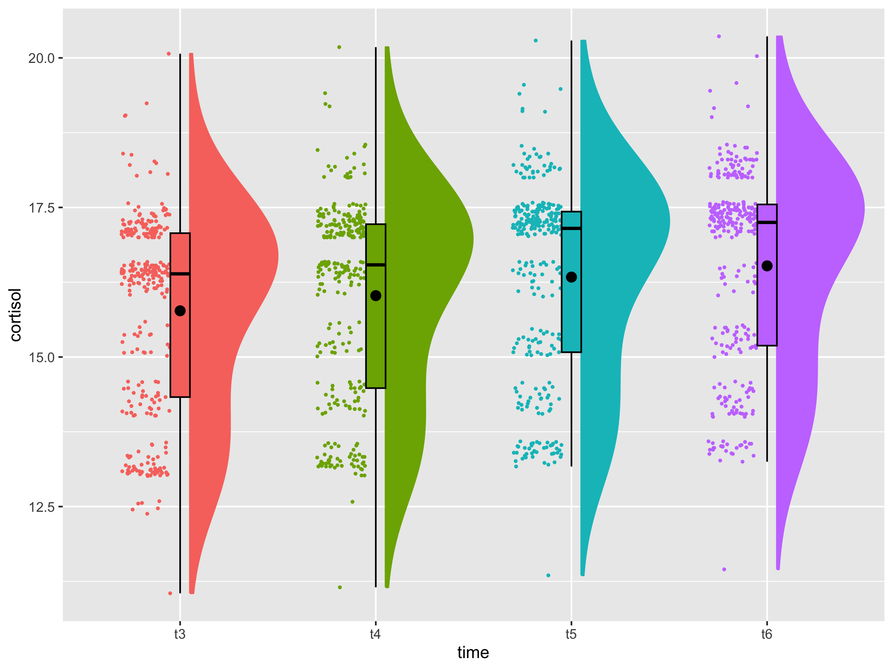

# Coping Strategies and Stress Recovery
This repository contains the scripts necessary to preprocess, analyze, print and plot the result to answer the following research question: 

**How do children's coping strategies impact their physiological indicies of stress recovery?**

## Background
Stress is a condition of the mind-body interaction [(McEwen, 2006)](https://www.ncbi.nlm.nih.gov/pmc/articles/PMC3181832/). The body responds to almost any event or challenge by releasing chemical mediators -e.g., catecholamines that increase heart rate and blood pressure -that help us cope with the situation. However, prolonged stress leads to latent vulnerabilities. At the theoretical level, most prevailing models of developmental psychopathology recognize the potential importance of psychosocial stress in the aetiology and maintenance of both internalizing and externalizing disorders in youth [(McMahon et al., 2003)](https://cdn.vanderbilt.edu/vu-my/wp-content/uploads/sites/2804/2019/04/14195723/McMahon-et-al-2003-J-of-Child-Psychology-and-Psychiatry.pdf).

Therefore, this study aimed to study the impact of children's coping strategies on their stress recovery, represented by `Blood Pressure`, `Heart Rate` and `Cortisol Level`. 

## Dataset
Data used in this study is a subset of the CEDS data, which can be found on [UK Data Service ](https://reshare.ukdataservice.ac.uk/851918/). The sample included 400 children (49% female, 51% male) who participated in the Children's Experiences and Development Study (CEDS), conducted from 2009 through 2011 in England. CEDS children were born between 1999 and 2001 and were initially assessed as part of a separate study of over 6,000 families when they were three years old. 

More details of the CEDS sampling frame can be found in the original paper: 
> Jaffee, Sara and Melhuish, Edward and Belsky, Jay (2015). Children's experiences and development study. [Data Collection]. Colchester, Essex: UK Data Archive. 10.5255/UKDA-SN-851918

After downloading and unzipping the dataset from the above repository, locate the file named `Archived_CEDS_Documentation` in the `Data` folder, where you can find the original dataset. 

## Measurement 
The study focused on `Stress Recovery`, represented by `HR`, `BP`, `Cortisol` and `Coping Strategies`. 

**Blood pressure and HR** were measured _five times_ throughout the stress-inducing task. 

**Cortisol** was measured _seven times_, as shown in the figure below. Our study focused on stress recovery; therefore, only `BP3Time`, `BP4Time`, `BP5Time`, `PulseAv3`, `PulseAv4`, `PulseAv5`, `t3`, `t4`, `t5`, and `t6` were considered as predictors.

  

**Coping Strategies** were measured using the [Manual for the Children's Coping Strategies Checklist & How I coped Under Pressure Scale](https://www.yumpu.com/en/document/read/12240213/manual-for-the-childrens-coping-strategies-checklist). There are four dimensions of coping strategies according to the scale: `active coping`, `avoidant`, `support seeking` and `distraction strategies`. 
The scoring sheet is shown in the figure below.

  

## Usage
The script described below is named `LDA.md`. Figures will be saved in the `Figure` folder. We have broken down processing into 3 stages, outlined below.

Before running the script below, ensure that packages `afex` and `lavaan` are stored in the R studio.

### Preprocessing 

Data Naming Conventions

|Coping Strategies | Variable Given Name|
| ------------- | ------------- |
| Active Coping Strategies  | act1-12  |
| Avoidant Strategies  | av1-6  |
| Support Seeking Coping Strategies | supp1-4 |
| Distraction Strategies  | distr1-4 |

|Name in `Archived_CEDS_Documentation.csv`  | Name in our script |
| ------------- | ------------- |
| Saliva1Time  | starting_cortisol  |
| Saliva2Time  | t2  |
| Saliva3Time | t3 |
| Saliva4Time  | t4 |
| Saliva5Time | t5  |
| Saliva6Time  | t6 |
| BP1Time  | starting_BP |
|BP3Time|BP3Time| 
|BP4Time| BP4Time| 
|BP5Time|BP5Time|
| CCSC01|act1-12  |
| CCSC02  | av1 |
| CCSC03  | act2  |
| CCSC04  | act3 |
|CCSC05|av2|
|CCSC06|supp1|
|CCSC07|av3|
|CCSC08|act4|
|CCSC09|av4|
|CCSC10|supp2|
|CCSC11|act5|
|CCSC12|distr1|
|CCSC13|supp3|
|CCSC14|act6|
|CCSC15|distr2|
|CCSC16|act7|
|CCSC17|act8|
|CCSC18|supp4|
|CCSC19|av5|
|CCSC20|distr3|
|CCSC21|act9|
|CCSC22|act10|
|CCSC23|act11|
|CCSC24|av6|
|CCSC25|distr4|
|CCSC26|act12|

#### Data Exploration
We first explored the changes in `BP`, `HR`, and `Cortisol` overtime after the stress-inducing task using the raincloud plot.

  
  
  

#### Filtering outliers
Outliers for BP and Cortisol at each time point were identified and filtered, respectively, based on [Tukey's range test](https://api.repository.cam.ac.uk/server/api/core/bitstreams/911a5707-d540-4338-9341-2fff8ea92bf5/content)

### Model fitting 
To investigate the relationship between physiological stress recovery and coping strategies, we initially wanted to examine whether changes in 
We fit the Linear-Mixed Effect (LME) model 

### Model comparison

## Results

## Discussion

