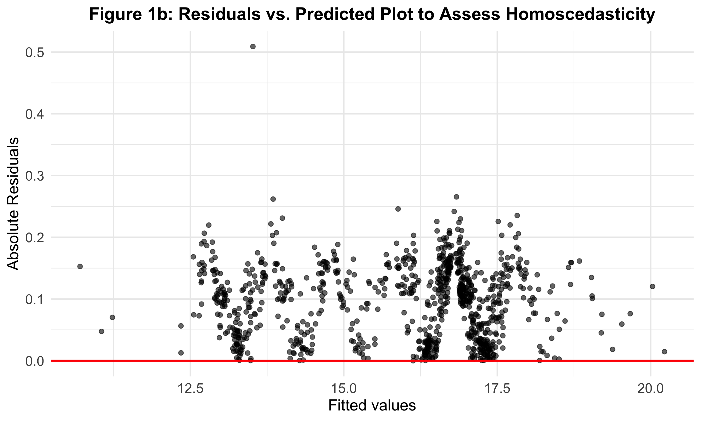

# Coping Strategies and Stress Recovery

This repository contains the scripts necessary to preprocess, analyze, print and plot the result to answer the following research question:

**How do children's coping strategies impact their physiological indicies of stress recovery?**

## Background

Stress is a condition of the mind-body interaction [(McEwen, 2006)](https://www.ncbi.nlm.nih.gov/pmc/articles/PMC3181832/). The body responds to almost any event or challenge by releasing chemical mediators -e.g., catecholamines that increase heart rate and blood pressure -that help us cope with the situation. However, prolonged stress leads to latent vulnerabilities. At the theoretical level, most prevailing models of developmental psychopathology recognize the potential importance of psychosocial stress in the aetiology and maintenance of both internalizing and externalizing disorders in youth [(McMahon et al., 2003)](https://cdn.vanderbilt.edu/vu-my/wp-content/uploads/sites/2804/2019/04/14195723/McMahon-et-al-2003-J-of-Child-Psychology-and-Psychiatry.pdf).

Therefore, this study aimed to study the impact of children's coping strategies on their stress recovery, represented by `Blood Pressure`, `Heart Rate` and `Cortisol Level`.

## Dataset

Data used in this study is a subset of the CEDS data, which can be found on [UK Data Service](https://reshare.ukdataservice.ac.uk/851918/). The sample included 400 children (49% female, 51% male) who participated in the Children's Experiences and Development Study (CEDS), conducted from 2009 through 2011 in England. CEDS children were born between 1999 and 2001 and were initially assessed as part of a separate study of over 6,000 families when they were three years old.

More details of the CEDS sampling frame can be found in the original paper: \> Jaffee, Sara and Melhuish, Edward and Belsky, Jay (2015). Children's experiences and development study. [Data Collection]. Colchester, Essex: UK Data Archive. 10.5255/UKDA-SN-851918

After downloading and unzipping the dataset from the above repository, locate the file named `Archived_CEDS_Documentation` in the `Data` folder, where you can find the original dataset.

## Measurement

The study focused on `Stress Recovery`, represented by `HR`, `BP`, `Cortisol` and `Coping Strategies`.

**Blood pressure and HR** were measured *five times* throughout the stress-inducing task.

**Cortisol** was measured *seven times*, as shown in the figure below. Our study focused on stress recovery; therefore, only `BP3Time`, `BP4Time`, `BP5Time`, `PulseAv3`, `PulseAv4`, `PulseAv5`, `t3`, `t4`, `t5`, and `t6` were considered as predictors.

**Coping Strategies** were measured using the [Manual for the Children's Coping Strategies Checklist & How I coped Under Pressure Scale](https://www.yumpu.com/en/document/read/12240213/manual-for-the-childrens-coping-strategies-checklist). There are four dimensions of coping strategies according to the scale: `active coping`, `avoidant`, `support seeking` and `distraction strategies`. The scoring sheet is shown in the figure below.

## Usage

The script described below is named `LDA.md`. Figures will be saved in the `Figure` folder. We have broken down processing into 3 stages, outlined below.

Before running the script below, ensure that packages `afex` and `lavaan` are stored in the R studio.

## Data Analysis

### Preprocessing

Data Naming Conventions

| Coping Strategies                 | Variable Given Name |
|-----------------------------------|---------------------|
| Active Coping Strategies          | act1-12             |
| Avoidant Strategies               | av1-6               |
| Support Seeking Coping Strategies | supp1-4             |
| Distraction Strategies            | distr1-4            |

| Name in `Archived_CEDS_Documentation.csv` | Name in our script |
|-------------------------------------------|--------------------|
| Saliva1Time                               | starting_cortisol  |
| Saliva2Time                               | t2                 |
| Saliva3Time                               | t3                 |
| Saliva4Time                               | t4                 |
| Saliva5Time                               | t5                 |
| Saliva6Time                               | t6                 |
| BP1Time                                   | starting_BP        |
| BP3Time                                   | BP3Time            |
| BP4Time                                   | BP4Time            |
| BP5Time                                   | BP5Time            |
| CCSC01                                    | act1-12            |
| CCSC02                                    | av1                |
| CCSC03                                    | act2               |
| CCSC04                                    | act3               |
| CCSC05                                    | av2                |
| CCSC06                                    | supp1              |
| CCSC07                                    | av3                |
| CCSC08                                    | act4               |
| CCSC09                                    | av4                |
| CCSC10                                    | supp2              |
| CCSC11                                    | act5               |
| CCSC12                                    | distr1             |
| CCSC13                                    | supp3              |
| CCSC14                                    | act6               |
| CCSC15                                    | distr2             |
| CCSC16                                    | act7               |
| CCSC17                                    | act8               |
| CCSC18                                    | supp4              |
| CCSC19                                    | av5                |
| CCSC20                                    | distr3             |
| CCSC21                                    | act9               |
| CCSC22                                    | act10              |
| CCSC23                                    | act11              |
| CCSC24                                    | av6                |
| CCSC25                                    | distr4             |
| CCSC26                                    | act12              |

#### Data Exploration

We first explored the changes in `BP`, `HR`, and `Cortisol` overtime after the stress-inducing task using the raincloud plot.

  

#### Filtering outliers

Outliers for BP and Cortisol at each time point were identified and filtered, respectively, based on [Tukey's range test](https://api.repository.cam.ac.uk/server/api/core/bitstreams/911a5707-d540-4338-9341-2fff8ea92bf5/content)

### Model fitting

To investigate the relationship between physiological stress recovery and coping strategies, we initially wanted to examine whether changes in the slope of blood pressure can be predicated by coping strategies and attempted to do so through both linear-mixed effects model (LME) with random slopes and intercepts and structural equation modelling (SEM). However, the data was insufficient for random slopes to be fitted and negative variance (Heywood cases) emerged while fitting the SEM model. This suggested to us that neither of those models were appropriate for the data.

Ultimately, our theory driven LME model to predict BP included an interaction term for the time point when BP was sampled (time) and supportive coping and included random intercepts for each participant to account for individual variance in their peak level of BP. To test for a linear trend in changes in BP across recovery, we applied polynomial contrasts to the categorical factor time.

> **Mod 1 = BP \~ time \* supportive_coping + (1\|ID)**

### Model comparison

To ensure this model was the most appropriate for the data, we conducted stepwise regression comparison.

We compared the theoretical model against the following models using chi-squared difference test:

-   Mod 2: BP predicated by only **random intercepts**

-   Mod 3: BP predicated by **supportive coping**

-   Mod 4: BP predicated by **time**

In all model comparisons but the last one, the theoretical model was significantly better (all p\<2.2e-16). When the theoretical model was compared against Mod 4, the chi-squared difference test showed no significant difference (p\>1). A further examination of the Akaike information criterion (AIC) and Bayesian information criterion (BIC) suggest that Mod 4 produces a slightly better fit for the data than our theoretical model.

|         | Mod 1 (theoretical model) | Mod 3 (model with only time) |
|---------|---------------------------|------------------------------|
| **AIC** | 893.26                    | 903.03                       |
| **BIC** | 931.97                    | 931.97                       |

As we are interested in the relationship between coping strategies and the theoretical model is not a significantly worse fit for the data, we decided to proceed with examining the results of the theoretical model.

### Assessing model assumptions

Both visual inspection of Q-Q plots and Shapiro-Wilk test for normality did not indicate a violation (Figure 1a), and both visual inspection of residuals vs. predicated plots and Breusch-Pagan test for homoscedascity did not indicate an assumption violation (Figure 1b).

{width="270" height="185"}

{width="270" height="179"}

**NEED TO ADD Linearity**

## Results

The package "[afex](https://cran.r-project.org/web/packages/afex/index.html)" was used to obtain p-values for the terms included for the linear-mixed effects model and the package "[effectsize](https://cran.r-project.org/web/packages/effectsize/index.html)" was used to compute the effect size of predictors.

Results of the model showed a significant main effect of time (*F* (2, 618)=145.55, *p*\<0.001 *ηp*2= 0.32) but no main effect of supportive coping. However, there was a significant interaction between time and supportive coping (*F* (2, 618)=7.78, *p*\<0.001 *ηp*2= 0.02), suggesting that the main effect of time cannot be interpreted in isolation. Post-hoc pairwise comparisons using estimated marginal means (EMM) suggested that when supportive coping is held at 9.75, there is a significant difference between BP levels at all three time points, where BP demonstrates significant increases from time 3 across to time 5 (Figure 2).

**Table 1: Pairwise comparisons between BP levels when supportive coping is 9.75**

| Comparison        | Estimate | SE     | t-ratio | p-value |
|-------------------|----------|--------|---------|---------|
| BP at Time3 vs. 4 | -0.351   | 0.0111 | -31.694 | \<.0001 |
| BP at Time3 vs. 5 | -0.531   | 0.0111 | -47.888 | \<.0001 |
| BP at Time4 vs. 5 | -0.180   | 0.0111 | -16.194 | \<.0001 |

As we are also interested whether there would be group differences in BP levels for individuals with different levels of supportive coping, we classed participants' supportive coping as either "high" (n=378) or "low" (n=555) based on the median level of supportive coping, and fitted another LME model with "supportive coping class" as a predictor instead of supportive coping values, and both time and supporting coping class contrast coded using polynomial contrasts.

> **Model: BP \~ time \* supp_class + (1\|ID)**

The results of this LME model replicated that of the previous model, with a significant main effect of time (*F* (2, 618)=1108.07, *p*\<0.001 *ηp*2= 0.32) and a significant interaction between time and supportive coping class (*F* (2, 618)=4.52, *p*\<0.05 *ηp*2= 0.02). This supports the appropriateness of converting supportive coping to a categorical variable.

Post-hoc pairwise comparisons suggest that this interaction was primarily driven by the following contrasts (Table 2). An examination of the pairwise comparisons suggest that participants of high and low supportive coping both show increases in their BP levels across each recovery time point (estimates from -0.34 to -0.15 in high supportive coping group; -0.35 to -0.20 to low supportive coping group), but there are no significant group differences at each time point (Figure 3).

**Table 2: Pairwise comparisons between BP levels at high and low levels of supportive coping**

| Comparison                     | Estimate | SE     | t-ratio | p-value |
|--------------------------------|----------|--------|---------|---------|
| Time 3 (high) - Time 4 (high)  | -0.34151 | 0.0175 | -19.500 | \<.0001 |
| Time 3 (high) - Time 5 (high)  | -0.49199 | 0.0175 | -28.093 | \<.0001 |
| Time 4 (high) - Time 5 (high)  | -0.15048 | 0.0175 | -8.593  | \<.0001 |
| Time 5 (high) - Time 3 (low)   | 0.55156  | 0.1910 | 2.887   | \<0.05  |
| Time 3 (low) - Time 4 (low)    | -0.35827 | 0.0145 | -24.789 | \<.0001 |
| Time 3 (low) - Time 5 (low)    | -0.55768 | 0.0145 | -38.586 | \<.0001 |
| Time 4 (low) - Time 5 (low)    | -0.19941 | 0.0145 | -13.797 | \<.0001 |

## Discussion

-   **This suggests that the inclusion of supportive coping in addition to starting BP does not account for significant more variance in BP levels (move to discussion);** Effect size of supportive coping is small
-   didnt examine the effects of other coping strategies
-   could've controlled for other factors like demographic, risk level, gender, etc.
